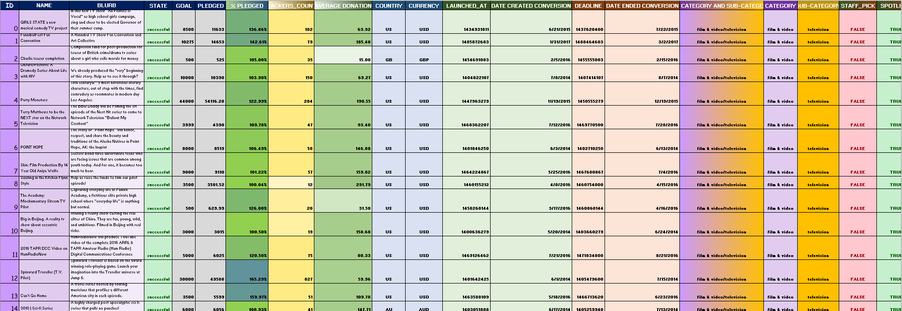
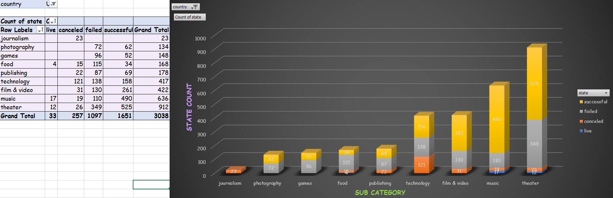
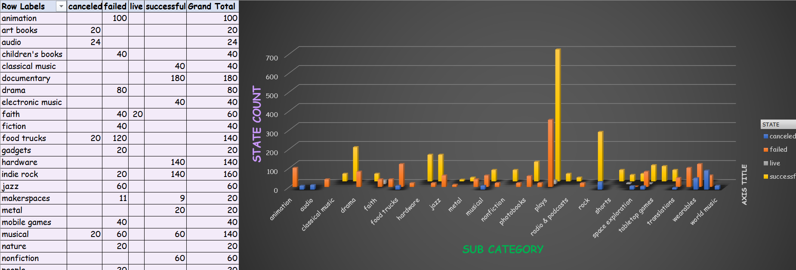
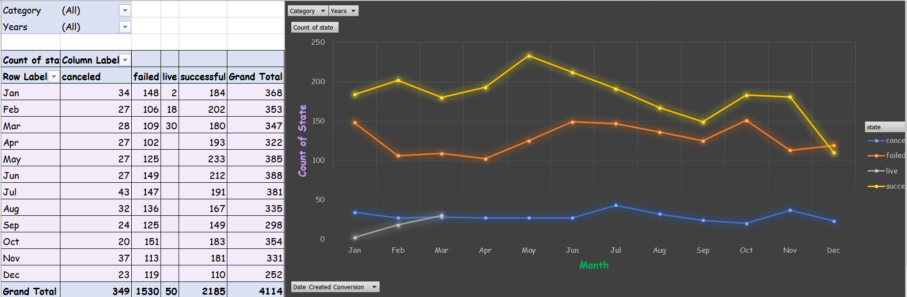
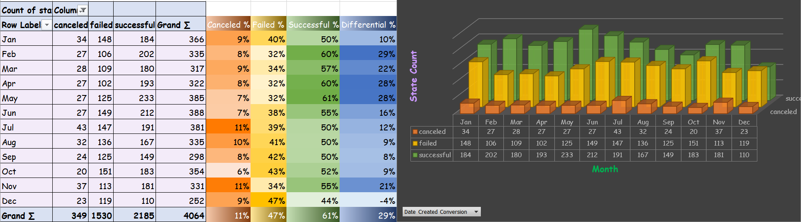

# Kick Start Chart

## The Data:
---
 

## Task:
---
Analyze 4,115 projects from Kickstarter to uncover any hidden trends that show whether or not a project will be successful.

## Tools:
---
For this project I used Microsoft Excel. Conditional formatting was used to differentiate if the state of a project was "successful", "failed", "cancelled", or is "live". Formulas were used to calculate the percent of how much money a campaign made towards reaching its goal. Formulas were also used to split the title of the column "Category and Sub-Category" into two new columns labeled "Category" and "Sub-Category". A pivot table was created to analyze how many campaingns were "successful", "failed", "cancelled", or "live".
 
 

## Conclusions:
---
According to this data, a Kickstarter started in Q2 has a 15.5% success rate and a 9.1% fail rate, while a Kickstarter started in Q4 has an 11.5% success rate and a 9.3% fail rate. Because the fail rate between Q2 and Q4 has a negligible difference, and the success rate between those two quarters is 4% better when started in Q2, Q2 is the better time to start a new campaign.
The cancel rate for Q1, Q2, Q3 and Q4 is 2.2%, 2.0%, 2.4% and 1.9% respectively. Therefore all quarters have approximately the same cancel rate. Plays made up 31.76% of successful campaigns, and 23.07% of failed campaigns.
 
 

## Limitations:
---
A useful stat to explore is how the campaign was advertised; ie email, facebook, radio, etc. And the currencies used are all specific to a region, if they were converted to dollars I would have a better perspective of the columns goal, pledged and average amount pledged.
 
 

